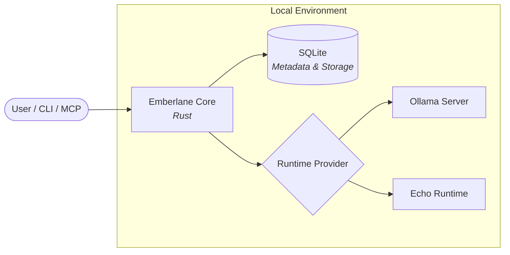
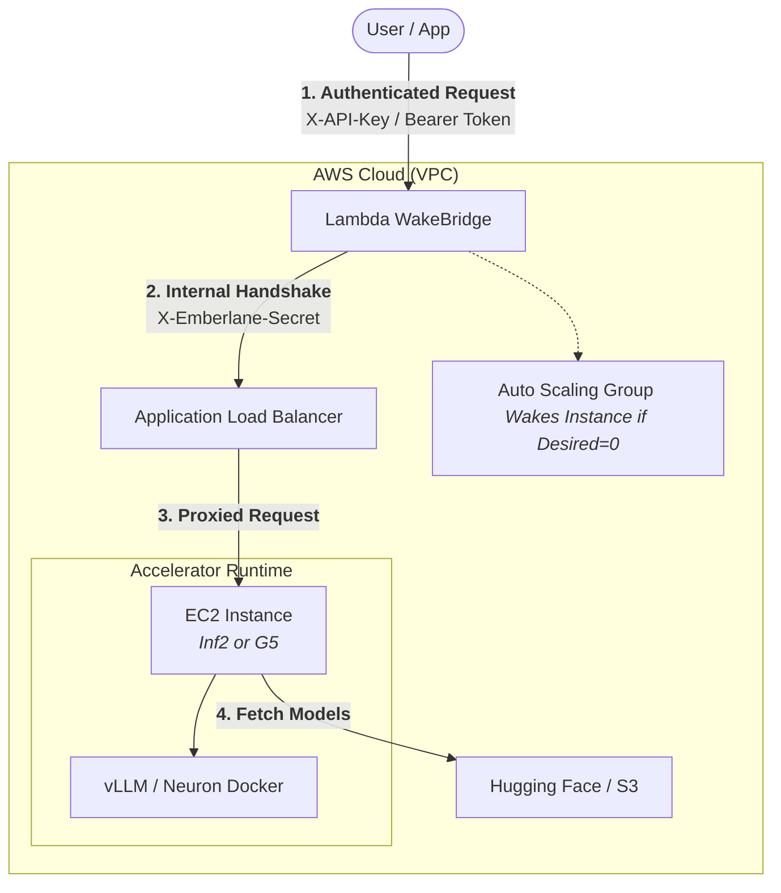

# Emberlane

Your own OpenAI-compatible AI endpoint. Run locally with Ollama or deploy to AWS with scale-to-zero.

[](https://github.com/anishk123/emberlane/actions)


Emberlane is a Scale-to-Zero LLM Gateway. It allows you to deploy high-performance hardware (NVIDIA/Inferentia) on-demand, wakes the target runtime when a request arrives, and automatically scales back to zero when idle to save costs.

This repository is a public alpha: specialized for AWS dev/test deployments where cost-efficiency and security are primary goals.

Supported interfaces in this release:

- CLI for deployment and operations.
- MCP stdio for agent and developer-tool integration.
- HTTP/OpenAI-compatible API for applications and existing OpenAI-compatible clients.

AWS is the first implemented cloud backend. Google Cloud and Azure are future backends, not implemented today.

## What Emberlane Does

- Automates AWS runtime infrastructure deployment via Terraform.
- Implements specialized **Scale-to-Zero** controllers for G5 (NVIDIA) and Inf2 (Inferentia2) instances.
- Secure **Secret Handshake** architecture using ALB and Lambda WakeBridge.
- Integrated CLI for deployment, benchmarking, and real-time cost auditing.
- Supports OpenAI-compatible chat and file-chat protocols.

## Why Emberlane?

Running high-performance LLMs in the cloud is expensive. A single `g5.xlarge` instance costs ~$730/month if left running. Emberlane solves this by automating the **Scale-to-Zero** lifecycle.

| Feature | Always-On (Standard) | Emberlane (Economy) |
| :--- | :--- | :--- |
| **Idle Cost** | ~$1.00 / hour | **$0.01 / hour** (ALB + Lambda) |
| **Security** | Public Port 8000 | **Secret Handshake (Encrypted)** |
| **Startup** | Instant | 2-4 mins (Cold) / <30s (Warm Pool) |
| **Ops** | Manual setup | **One-command deploy** |

Emberlane is for developers who want "Production-ish" hardware (G5/Inf2) but only want to pay for it when they are actually using it.

## Which Interface To Use

Use the CLI for:

- local setup
- AWS deploy
- benchmark
- cost report
- cleanup
- diagnostics

Use MCP for:

- agent interaction
- chat
- file upload
- chat with file
- runtime wake/status

Use the HTTP/OpenAI-compatible API for:

- app integration
- existing OpenAI-compatible clients
- runtime and gateway integration

## High-Performance Hardware

Emberlane targets professional-grade accelerators and is optimized for:

- **NVIDIA G5 (g5.xlarge+):** Using `cuda-vllm` for standard high-throughput inference.
- **AWS Inferentia2 (inf2.xlarge+):** Using `inf2-neuron` for the most cost-efficient inference path.
- **Warm Pools:** Support for ASG Warm Pools to enable <30s wake times while maintaining scale-to-zero costs.

## AWS Deployment Quickstart

This is the AWS Terraform deployment path for Emberlane. You can use the interactive CLI mode that securely handles token storage and model selection:

```sh
cargo run -- aws init
cargo run -- aws deploy 
```

Or deploy directly via command line (especially useful for gated models that require a Hugging Face token):

```sh
cargo run -- aws deploy \
  --profile emberlane \
  --model llama31_8b \
  --accelerator cuda \
  --instance g5.xlarge \
  --mode economy \
  --hf-token "hf_your_token_here"
```

If you want to review the generated Terraform variables first, add `--plan-only`:

```sh
cargo run -- aws deploy \
  --profile emberlane \
  --model llama31_8b \
  --accelerator cuda \
  --instance g5.xlarge \
  --mode economy \
  --plan-only
cargo run -- aws chat "Explain scale-to-zero inference"
cargo run -- aws benchmark
cargo run -- aws cost-report
cargo run -- aws destroy
```

AWS deploy defaults to CUDA/G5/economy. Inf2/Neuron remains available as an experimental cost-optimization path.

## AWS Credentials

Check credentials before deploying or running live tests:

```sh
cargo run -- aws credentials check --profile emberlane
```

Supported setup paths:

```sh
aws login --profile emberlane
cargo run -- aws credentials check --profile emberlane
cargo run -- aws init --profile emberlane --force
```

```sh
aws configure
```

```sh
aws configure --profile emberlane-dev
cargo run -- aws init --profile emberlane-dev
```

```sh
aws configure sso
aws sso login --profile <profile>
```

```sh
export AWS_ACCESS_KEY_ID=...
export AWS_SECRET_ACCESS_KEY=...
export AWS_REGION=us-west-2
```

Emberlane does not ask you to type raw AWS secrets into its config. Prefer AWS CLI profiles, SSO, or environment variables.

`aws login --profile emberlane` is a good path on AWS CLI versions that support it. Emberlane stores and passes the profile name, not raw credentials.

Emberlane deploy uses Terraform. On macOS with Homebrew:

```sh
brew tap hashicorp/tap
brew install hashicorp/tap/terraform
terraform version
```

## Live Testing

Local repeatable tests do not create AWS resources:

```sh
cargo run -- test local --runtime echo
cargo run -- test local --runtime ollama
```

Live AWS tests create billable resources and require explicit opt-in:

```sh
cargo run -- test aws \
  --model tiny_demo \
  --accelerator cuda \
  --instance g4dn.xlarge \
  --mode economy \
  --destroy \
  --yes-i-understand-this-creates-aws-resources
```

Matrix test:

```sh
cargo run -- test aws-matrix \
  --config tests/aws-matrix.example.toml \
  --destroy \
  --exclude-experimental \
  --yes-i-understand-this-creates-aws-resources
```

Use `--keep-on-failure` only for debugging. Run `cargo run -- aws cleanup --dry-run` to inspect cleanup actions. See `docs/live-aws-testing.md`.

## Model Choices

Model profiles live in `profiles/models.toml`.

```sh
cargo run -- aws models
```

Recommended first path:

- `llama31_8b`: Llama 3.1 8B Instruct on CUDA/G5.
- `qwen25_7b`: Qwen 2.5 7B Instruct on CUDA/G5.
- `tiny_demo`: lower-cost CUDA demo profile.

Experimental:

- `deepseek_distill_qwen_7b`: CUDA/G5 experimental profile.
- `llama32_1b_inf2`: Inf2/Neuron experimental profile.
- `qwen25_15b_inf2`: Inf2/Neuron experimental profile.

Emberlane does not claim a model is validated unless there is a real validation record.

## Cost Modes

```sh
cargo run -- aws modes
```

- `economy`: ASG min `0`, desired `0`, max `1`, Warm Pool disabled. Lowest idle cost expectation, coldest wake path.
- `balanced`: ASG min `0`, desired `0`, max `1`, Warm Pool enabled. Warmer starts when the pool has capacity, with some storage/prepared-capacity cost.
- `always-on`: ASG min `1`, desired `1`, max `1`, Warm Pool disabled. Highest idle cost, fastest response.

Benchmark results are workload, AMI, model, quota, and region dependent. Emberlane does not promise exact latency or savings.

## Benchmarking

```sh
cargo run -- aws benchmark
cargo run -- aws cost-report
```

`benchmark` records provider, accelerator, model profile, instance type, mode, Warm Pool setting, elapsed timing, and result preview/error. `cost-report` refuses to claim savings without real pricing input and instead explains the hot vs economy vs balanced tradeoff.

## File Upload And Chat With File

```sh
cargo run -- upload README.md
cargo run -- chat-file ollama <file_id> "summarize this"
```

Only `.txt` and `.md` are parsed for inline file-context chat. Local storage is default. Optional S3 artifact storage exists for AWS runtimes; see `docs/s3-artifact-store.md`.

## MCP Support

Emberlane exposes MCP stdio tools for agents and developer tools. MCP is the recommended integration path for agent clients because tools can wake runtimes, upload files, chat with files, and inspect runtime status without inventing a custom integration.

HTTP/OpenAI-compatible endpoints are recommended for applications and runtime integrations. The CLI is recommended for deployment, benchmarking, cleanup, and operations.

```sh
cargo run -- mcp
```

Supported MCP tools:

- `emberlane_list_runtimes`
- `emberlane_status`
- `emberlane_chat`
- `emberlane_upload_file`
- `emberlane_chat_file`
- `emberlane_wake`
- `emberlane_sleep`

## Architecture

### Local Development

When running locally, Emberlane acts as an intelligent proxy and state manager.



### AWS Deployment (Scale-to-Zero)

The AWS architecture is designed for security and cost efficiency. It uses a "Secret Handshake" between the Entry Point and the Hardware.



**Security Features:**
- **External Auth:** The Lambda entry point requires a valid API Key.
- **Internal Handshake:** The Load Balancer rejects all traffic unless it contains a cryptographically random secret header known only to your Lambda.
- **Hardware Isolation:** EC2 instances are shielded by Security Groups and only accept traffic from the Load Balancer.

## Implemented Now

- Local echo runtime.
- Local Ollama runtime.
- HTTP API for chat, files, runtime status, and OpenAI-compatible chat.
- MCP stdio for core chat/upload/chat-file tools.
- CLI operations for local setup, AWS deploy, benchmark, cost report, diagnostics, and cleanup.
- AWS ASG WakeBridge provider.
- Python Lambda WakeBridge and Node streaming bridge.
- Terraform AWS deployment pack.
- Optional S3 artifact storage.
- Experimental Inf2/Neuron runtime pack.

## Planned

- Python SDK.
- TypeScript SDK.
- GCP backend.
- Azure backend.
- Richer UI.

## Not Implemented Yet

- Python SDK.
- TypeScript SDK.
- GCP backend.
- Azure backend.
- Managed RAG/search/workflow apps.
- Dashboards.
- Richer UI.
- Production multi-tenant auth.
- Fixed wake-time guarantees.

## Roadmap

- Harden CUDA/vLLM AWS runtime packaging.
- Add real pricing input for cost reports.
- Add validation records for model profiles.
- Add Python and TypeScript SDKs after CLI/MCP/HTTP stabilize.
- Expand cloud backends after AWS is solid.

See `docs/architecture.md`, `docs/aws-deploy-from-zero.md`, `docs/model-profiles.md`, `docs/cost-modes.md`, `docs/completeness-checklist.md`, `docs/roadmap/future-work.md`, and `docs/future-clouds.md`.

## License

Emberlane is dual-licensed under MIT OR Apache-2.0.

See `LICENSE-MIT` and `LICENSE-APACHE`.
