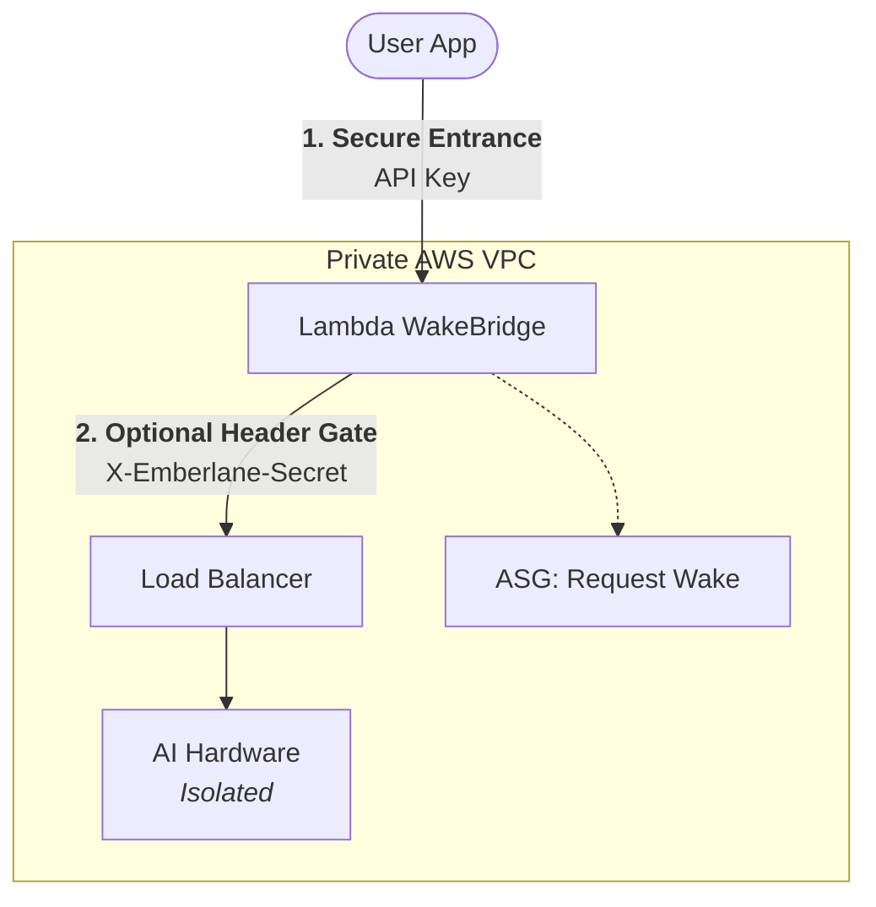

# 🔥 Emberlane: The $0.01/hr LLM Gateway

**Stop paying for idle GPUs.** Emberlane is a Scale-to-Zero gateway that puts professional-grade AI hardware (NVIDIA G5 / AWS Inferentia2) behind a secure, cost-saving shield.

[](https://github.com/anishk123/emberlane/actions)


---

## 🚀 The Mission
Running a `g5.2xlarge` 24/7 costs **roughly hundreds of dollars per month** depending on region and pricing model. Emberlane reduces idle cost by automating the entire "Scale-to-Zero" lifecycle. 

1. **Request Hits:** Your secure gateway wakes the hardware.
2. **AI Responds:** Requests are proxied instantly to vLLM.
3. **Idle Hits:** The hardware sleeps. You stop paying.

## ✨ Key Features
- ⚡ **Auto-scaling:** Zero to Ready in <30s (using ASG Warm Pools).
- 🔒 **Lambda WakeBridge:** Public Function URL entry point with an optional ALB header gate for extra dev/test friction.
- 🏎️ **Supported Runtimes:** CUDA/G5 is the default path; **AWS Inferentia2 (Inf2)** is available for experimental benchmarking.
- 🛠️ **CLI-First Ops:** Deploy, benchmark, and audit costs with a single command.
- 🤖 **OpenAI Compatible:** Drop-in replacement for any OpenAI-client.

---

## AWS Quickstart

Deploy your own private, secure endpoint in minutes:

```sh
# 1. Initialize your AWS environment
cargo run -- aws init --profile your-profile

# 2. Deploy your chosen model
# Run without --model for interactive selection.
# Default first path: Qwen 3.5 9B on g5.2xlarge.
cargo run -- aws deploy --mode balanced --profile your-profile

# Or specify a model directly:
cargo run -- aws deploy --model qwen35_9b --mode balanced --profile your-profile

# 3. Chat with your live cloud hardware!
cargo run -- aws chat "Why is Emberlane so cool?"
```

> **Pro-Tip:** Run `cargo run -- aws models` to see the full list of supported high-performance model profiles.

Emberlane cost modes map to AWS instance pricing as follows:
- `economy`: Spot instances, no warm pool
- `balanced`: On-demand instances, warm pool enabled
- `always-on`: On-demand instances, no warm pool

## AWS Terraform deployment
For repeatable AWS setup, see [docs/aws-deploy-from-zero.md](docs/aws-deploy-from-zero.md). The CLI renders Terraform variables, runs plan/apply, and manages destroy for you.

## 📐 Architecture (Secure-by-Default)

Emberlane doesn't just save money; it locks down your hardware. Your EC2 instances have **zero** public ports open.



---

## 📊 Why Choose Emberlane?

| Feature | Standard "Always-On" Deployment | **Emberlane** |
| :--- | :--- | :--- |
| **Monthly Cost** | ~$730.00 | **<$10.00** |
| **Idle Ports** | Publicly exposed | **Completely Isolated** |
| **Hardware** | Fixed | **Elastic (G5 / Inf2)** |
| **Complexity** | Manual Setup | **One command** |

---

## 🔥 Professional Hardware Support
- **NVIDIA G5:** The default first CUDA path. Qwen 3.5 9B on `g5.2xlarge` is the recommended starting point.
- **AWS Inferentia2:** Experimental and workload-dependent. It can be a good fit to benchmark, but it is not universally cheaper than NVIDIA G instances. `inf2.xlarge` is supported for experimental economy configurations, and CUDA/G5 remains the recommended first path.
- **ASG Warm Pools:** Supported for the `balanced` mode to keep prepared capacity available.
- **Spot vs On-Demand:** `economy` uses Spot instances; `balanced` and `always-on` use on-demand instances.

---

## 🛠️ Integrated MCP Support
Emberlane is a first-class citizen for AI agents. It exposes **MCP stdio tools** so your agents can wake runtimes, upload files, and chat with context automatically.

```sh
cargo run -- mcp
```

---

## Planned
- Python SDK
- TypeScript SDK

## Not Implemented Yet
- GCP backend
- Azure backend
- production UI
- full RAG
- managed hosted service

## 📜 License
Emberlane is dual-licensed under **MIT** or **Apache-2.0**. Start building for free.
