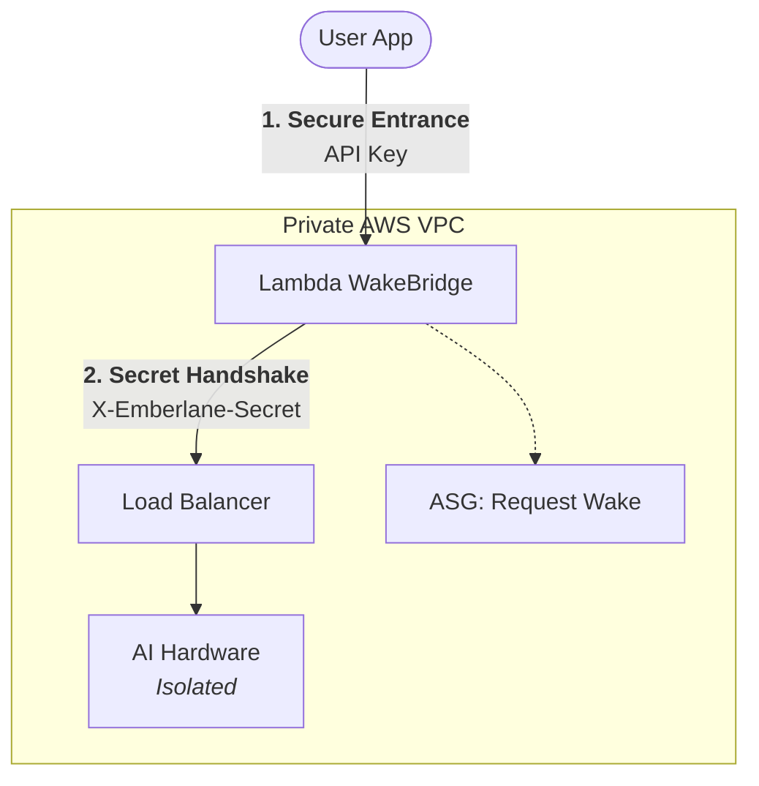

# 🔥 Emberlane: The $0.01/hr LLM Gateway

**Stop paying for idle GPUs.** Emberlane is a Scale-to-Zero gateway that puts professional-grade AI hardware (NVIDIA G5 / AWS Inferentia2) behind a secure, cost-saving shield.

[](https://github.com/anishk123/emberlane/actions)


---

## 🚀 The Mission
Running a `g5.xlarge` 24/7 costs **~$730/month**. Emberlane slashes that to under **$10/month** by automating the entire "Scale-to-Zero" lifecycle. 

1. **Request Hits:** Your secure gateway wakes the hardware.
2. **AI Responds:** Requests are proxied instantly to vLLM.
3. **Idle Hits:** The hardware sleeps. You stop paying.

## ✨ Key Features
- ⚡ **Auto-scaling:** Zero to Ready in <30s (using ASG Warm Pools).
- 🔒 **Secret Handshake:** Advanced security using ALB header validation and a Lambda WakeBridge entry point.
- 🏎️ **Optimized Runtimes:** Deeply tuned for **AWS Inferentia2 (Inf2)** and **NVIDIA G5**.
- 🛠️ **CLI-First Ops:** Deploy, benchmark, and audit costs with a single command.
- 🤖 **OpenAI Compatible:** Drop-in replacement for any OpenAI-client.

---

## 🛠️ Quickstart (AWS)

Deploy your own private, secure endpoint in minutes:

```sh
# 1. Initialize your AWS environment
cargo run -- aws init --profile your-profile

# 2. Deploy your chosen model (e.g., Llama 3.1 or Qwen)
cargo run -- aws deploy --model llama31_8b --mode economy

# 3. Chat with your live cloud hardware!
cargo run -- aws chat "Why is Emberlane so cool?"
```

## 📐 Architecture (Secure-by-Default)

Emberlane doesn't just save money; it locks down your hardware. Your EC2 instances have **zero** public ports open.



---

## 📊 Why Choose Emberlane?

| Feature | Standard "Always-On" Deployment | **Emberlane** |
| :--- | :--- | :--- |
| **Monthly Cost** | ~$730.00 | **<$10.00** |
| **Idle Ports** | Publicly exposed | **Completely Isolated** |
| **Hardware** | Fixed | **Elastic (G5 / Inf2)** |
| **Complexity** | Manual Setup | **One command** |

---

## 🔥 Professional Hardware Support
- **NVIDIA G5:** High-throughput CUDA inference via vLLM.
- **AWS Inf2:** The most cost-efficient inference on the planet, meticulously tuned for stability.
- **ASG Warm Pools:** Support for "Pre-warmed" instances for near-instant response times.

---

## 🛠️ Integrated MCP Support
Emberlane is a first-class citizen for AI agents. It exposes **MCP stdio tools** so your agents can wake runtimes, upload files, and chat with context automatically.

```sh
cargo run -- mcp
```

---

## 📜 License
Emberlane is dual-licensed under **MIT** or **Apache-2.0**. Start building for free.
