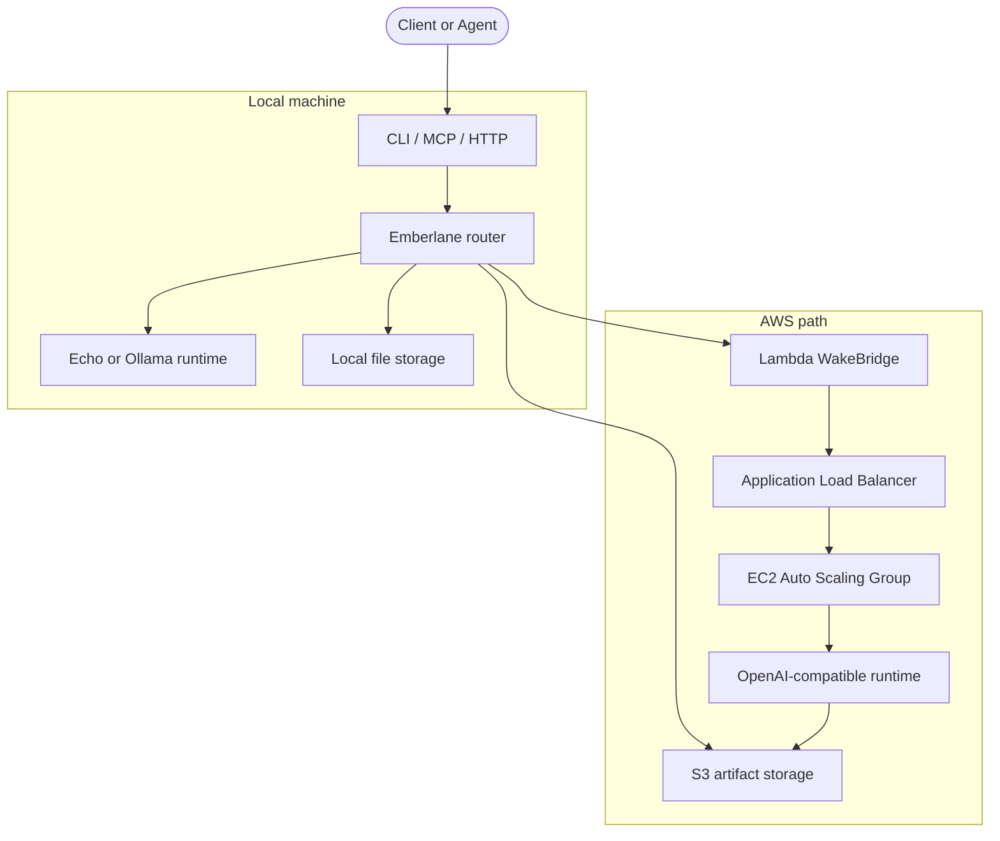

# Emberlane

AWS scale-to-zero LLM inference, with Ollama for development.

Run a single binary. Deploy model profiles to AWS when you want the cloud to wake up only on demand, or use Ollama locally when you are iterating.

[](https://github.com/anishk123/emberlane/actions)


## At A Glance

| | |
| --- | --- |
| ☁️ **AWS scale-to-zero** | Wake a model only when requests arrive, then let it sleep again when idle. |
| 🦙 **Ollama for dev** | Keep local iteration fast and simple with the runtime people already know. |
| 📦 **Model profiles** | Choose a profile once, then override model, mode, or instance when needed. |
| 🔌 **CLI / MCP / HTTP** | Deploy, automate, and integrate through the interface that fits the job. |

Emberlane is for people who want their own OpenAI-compatible endpoint on AWS, with local Ollama as the friendly dev path.

## What Emberlane Does

Emberlane ships as one CLI binary and can:

- ☁️ deploy an AWS scale-to-zero stack with Terraform
- 💬 run local chat with the built-in echo runtime
- 🦙 run local chat with Ollama
- 📄 upload text files and ask questions about one or more documents
- 🧠 expose MCP tools for agent clients
- 🌐 serve an HTTP and OpenAI-compatible API

## How Defaults Work

Emberlane is designed to be useful by default and adjustable when you need it.

- `profiles/models.toml` defines the model profiles Emberlane knows about.
- `emberlane.toml` stores local defaults for the CLI, local storage, and runtimes.
- `aws/emberlane.aws.toml` stores AWS deploy defaults such as region, profile, model, mode, and endpoint.
- CLI flags override config when you want a one-off change.

Recommended AWS first path:

- model: `qwen35_9b`
- instance: `g5.2xlarge`
- mode: `balanced` (starts ready, then scales down after idle)

Use `cargo run -- aws models` to inspect profiles, `cargo run -- aws modes` to inspect cost modes, and `cargo run -- aws print-config` to inspect the current AWS defaults before you deploy.

If you want to compare multiple models, deploy one profile at a time and use `aws benchmark` and `aws cost-report` to compare the real tradeoffs.

## Supported Interfaces

- 🖥️ CLI for local setup, AWS deploy, benchmarking, cost reports, diagnostics, and cleanup
- 🤖 MCP stdio for agent/tool integration
- 🌐 HTTP API for apps and internal services
- 🧩 OpenAI-compatible chat endpoints for existing clients

## Local Quickstart

```sh
cargo run -- init
cargo run -- serve
cargo run -- chat echo "hello"
cargo run -- chat ollama "hello"
cargo run -- upload README.md
cargo run -- chat-file echo <file_id> "summarize this"
cargo run -- chat-files echo <file_id_1> <file_id_2> --message "compare these notes"
cargo run -- mcp
```

If Ollama is unavailable, Emberlane will tell you how to install it, start it, and pull the model it expects.

## AWS Quickstart

```sh
cargo run -- aws credentials check --profile your-profile
cargo run -- aws init --profile your-profile
cargo run -- aws models
cargo run -- aws modes
cargo run -- aws print-config
cargo run -- aws deploy --profile your-profile --mode balanced
cargo run -- aws chat "Explain scale-to-zero inference" --profile your-profile
cargo run -- aws benchmark --profile your-profile
cargo run -- aws cost-report --profile your-profile
cargo run -- aws destroy --profile your-profile
```

If you want a guided deploy path, Emberlane renders Terraform variables, applies the stack, and stores the resolved endpoint in `aws/emberlane.aws.toml`.

## Multi-Model Workflow

Emberlane is designed so you can keep the defaults simple and still compare several models over time.

- Start with one default model profile.
- Deploy another profile when you want to compare behavior or cost.
- Keep inactive models scaled down or destroyed so you only pay for what is actually up.
- Use `aws benchmark` and `aws cost-report` to make the tradeoffs visible instead of guessing.

Example:

```sh
cargo run -- aws deploy --profile your-profile --model qwen35_9b --mode balanced
cargo run -- aws deploy --profile your-profile --model llama31_8b --mode economy
cargo run -- aws benchmark --profile your-profile
```

## AWS Terraform Deployment

For repeatable AWS setup, see [docs/aws-deploy-from-zero.md](docs/aws-deploy-from-zero.md). The CLI renders Terraform variables, runs plan/apply, and manages destroy for you.

## File Storage And Multi-Document Chat

Emberlane stores uploaded files locally by default. For AWS deployments, you can switch to S3-backed storage so remote runtimes can fetch uploaded documents without depending on your laptop.

```sh
cargo run -- storage use local
cargo run -- storage use s3 --profile your-profile --region us-west-2
```

When S3 storage is enabled, Emberlane will create the derived artifact bucket on demand if your AWS credentials allow it.

Upload one or more text documents:

```sh
cargo run -- upload README.md docs/aws-deploy-from-zero.md
```

Then ask a question about one or more uploaded documents:

```sh
cargo run -- chat-files qwen35_9b <file_id_1> <file_id_2> --message "compare the AWS deployment notes"
```

For a single document, `chat-file` still works:

```sh
cargo run -- chat-file ollama <file_id> "summarize this"
```

## Model Choices

Use `cargo run -- aws models` to list the available model profiles.

Each profile describes one model and the hardware Emberlane recommends for it.

The default AWS CUDA path is `qwen35_9b` on `g5.2xlarge` in `balanced` mode. That is the recommended first path for public release.

That default is tuned for text-only serving: Emberlane passes the profile-specific max context length, `--language-model-only`, and the Qwen3 reasoning parser so Qwen3.5 follows the official vLLM serving shape on the single-GPU `g5.2xlarge` path.

`balanced` is the default public-release operating point: one instance comes up ready, then Emberlane lets it sleep again after idle traffic drops away. `always-on` keeps the instance running after setup, and `economy` is the coldest on-demand path.

Inf2/Neuron is supported for experimental evaluation, but it is not presented as universally cheaper. Use it when you want to benchmark the hardware tradeoffs yourself.

For multi-model comparison:

- pick one model profile
- deploy it
- benchmark it
- destroy it if you are done
- repeat with another profile

## Cost Modes

| Mode | Default capacity | Warm pool | Pricing | Good for |
| --- | --- | --- | --- | --- |
| `economy` | min `0`, desired `0`, max `1` | Disabled | Spot | Cheapest cold-start path |
| `balanced` | min `0`, desired `1`, max `1` | Enabled | On-demand | Ready on deploy, scales down after idle |
| `always-on` | min `1`, desired `1`, max `1` | Disabled | On-demand | Never auto-sleeps |

These are defaults, not hard limits. You can override them in config or on the command line when you need something specific.

## MCP Support

Emberlane exposes MCP tools for agents and developer tools. Supported tools:

- `emberlane_list_runtimes`
- `emberlane_status`
- `emberlane_chat`
- `emberlane_upload_file`
- `emberlane_chat_file`
- `emberlane_wake`
- `emberlane_sleep`

MCP is the recommended integration path for agent clients. The HTTP/OpenAI-compatible endpoint is the recommended path for app integration. The CLI is the recommended path for deployment, benchmarking, and operations.

## Architecture

Emberlane is intentionally simple. Local requests stay local; AWS requests go through Lambda WakeBridge and the ALB before they reach the ASG runtime.



AWS is the first implemented hyperscaler backend. GCP and Azure are planned for later.

## Implemented Now

- local echo runtime
- local Ollama runtime
- file upload and chat with `.txt` / `.md`
- MCP stdio
- HTTP API
- OpenAI-compatible chat endpoint
- AWS Terraform deployment
- AWS benchmark and cost-report commands
- AWS S3-backed file storage

## Planned

- Python SDK
- TypeScript SDK
- GCP backend
- Azure backend
- richer UI

## Not Implemented Yet

- managed hosted service
- production multi-tenant auth
- dashboards

## License

Emberlane is dual-licensed under MIT OR Apache-2.0.
